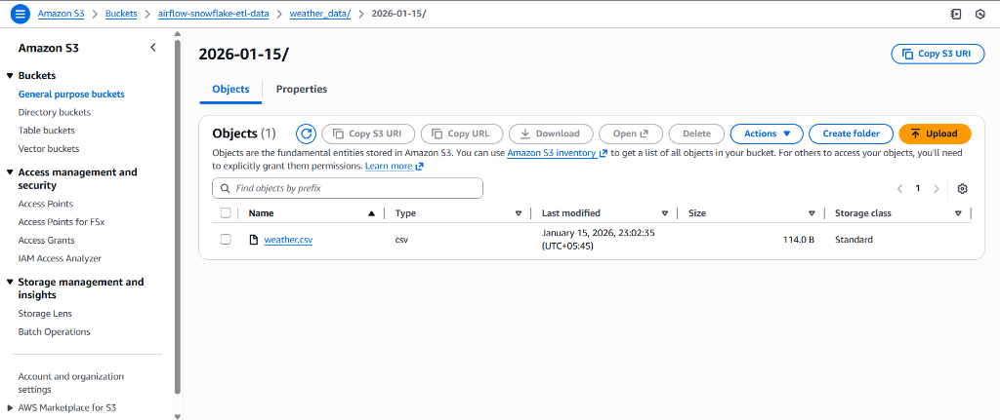
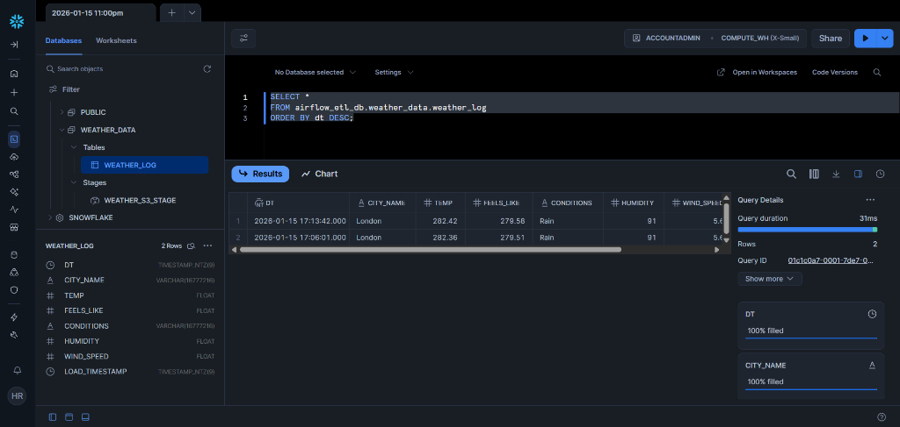
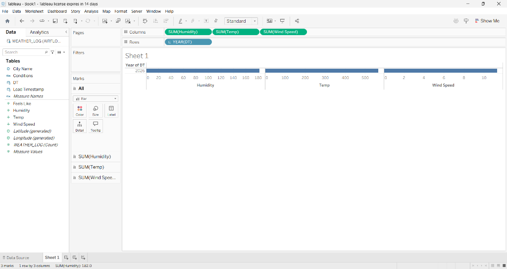
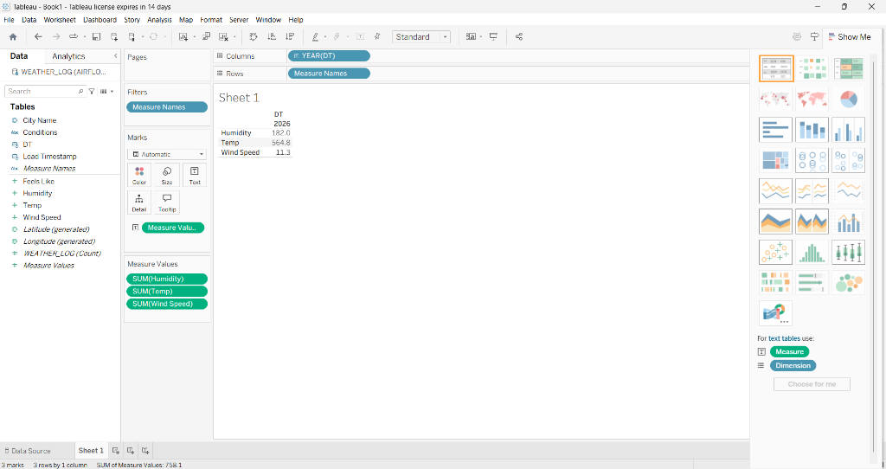

# SkyPulse Analytics

A complete end-to-end Data Engineering pipeline that extracts real-time weather data, buffers it in AWS S3, and loads it into Snowflake for analysis in Tableau.

## Project Overview

*   **Source**: OpenWeatherMap API (Real-time data for London)
*   **Orchestration**: Apache Airflow (Dockerized)
*   **Staging**: AWS S3 (`airflow-snowflake-etl-data`)
*   **Data Warehouse**: Snowflake (`airflow_etl_db`)
*   **Visualization**: Tableau

## Repository Structure

*   `dags/`: Contains the Airflow DAG (`weather_etl_dag.py`).
*   `scripts/`: SQL setup scripts for Snowflake (`setup_snowflake.sql`).
*   `docker-compose.yaml`: Airflow service configuration.
*   `.env`: Environment variables (API keys, Credentials).
*   `img/`: Project verification screenshots.

## Quick Start

### 1. Start Airflow
```bash
docker-compose up -d
```
Access UI at [http://localhost:8080](http://localhost:8080).

### 2. Setup Infrastructure
*   **Snowflake**: Run `scripts/setup_snowflake.sql` in your Snowflake Worksheet.
*   **Airflow Connections**:
    *   `aws_default`: Your AWS Access Key/Secret.
    *   `snowflake_default`: Your Snowflake Login/Password.
    *   **Variable**: `openweather_api_key` (Your OpenWeatherMap Key).

### 3. Run Pipeline
Trigger the `weather_etl_pipeline` DAG in Airflow.

## Project Gallery

### 1. Airflow Orchestration
Successfully running the ETL Data Pipeline.


### 2. S3 Staging
Data extracted from API and buffered in AWS S3.


### 3. Snowflake Retention
Data loaded into Snowflake Warehouse table `WEATHER_LOG` with all metrics.


### 4. Tableau Visualization
Visualizing the Multi-Metric Dashboard (Temp, Humidity, Wind Speed).


### 5. Data Metrics (Tabular)
Detailed view of weather metrics.

